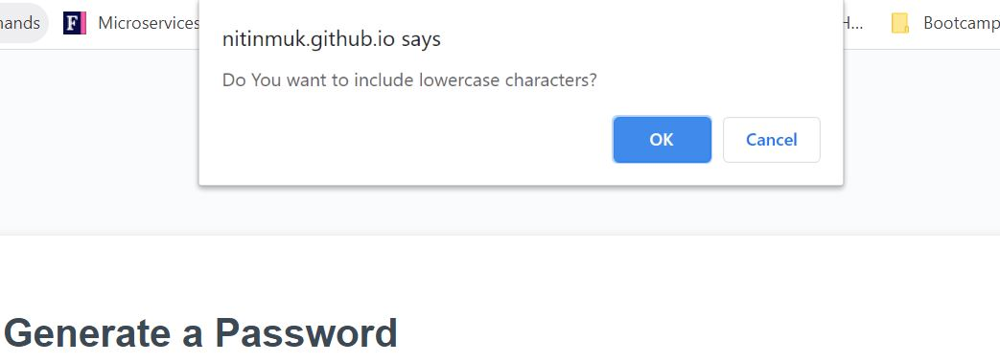

# Unit 03 JavaScript: Password Generator:
It is an application to generate a random password based on user-selected criteria. This app will run in the browser and feature dynamically updated HTML and CSS powered by JavaScript code. It will also feature a clean and polished user interface and be responsive, ensuring that it adapts to multiple screen sizes.

# Screenshots of built password generator application:

# Deployed application URL(link):
https://nitinmuk.github.io/password-generator/
